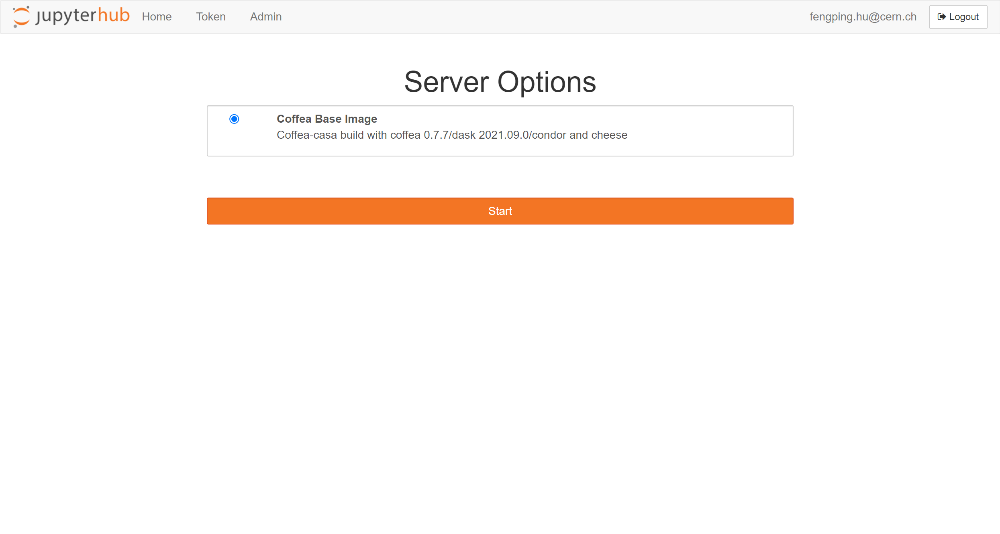

# Coffea Casa

## Prerequisites

The primary mode of analysis with coffea-casa is [coffea](https://coffeateam.github.io/coffea/index.html). Coffea provides plenty of examples to users in its [documentation](https://coffeateam.github.io/coffea/examples.html) A good starting point may be [this tutorial](https://github.com/CoffeaTeam/coffea-casa-tutorials/blob/master/analysis/analysis_tutorial.ipynb) on columnar analysis in coffea.

Knowledge of [Python](https://docs.python.org/3/tutorial/) is also assumed. Standard coffea analyses are contained within [Jupyter Notebooks](https://jupyter.org/), which allow for dynamic, block-by-block execution of code. Coffea-casa employs the [JupyterLab](https://jupyterlab.readthedocs.io/en/stable/user/interface.html) interface. JupyterLab is designed for hosting Jupyter Notebooks on the web, and permits the usage of additional features within its environment, including Git access, compatibility with cluster computing tools, and much, much more.

If you aren't familiar with any of these tools, please click on the links above for additional resources, and get acquainted with how they work. If you want examples of how coffea-casa merges these tools, refer to the gallery of coffea-casa examples.

## Access

   Please use [https://coffea.af.uchicago.edu](https://coffea.af.uchicago.edu) as an access point to the Coffea-Casa Analysis Facility @ UChicago.

   

## ATLAS AuthZ Authentication Instance

Currently Coffea-Casa Analysis Facility @ UChicago can support any member of ATLAS.

Sign in with your ATLAS CERN credential:

   

   

## Docker Image Selection

For high efficient analysis using *coffea* package, powered with *Dask* and *HTCondor* please select:

   

After you will be forwarded to your personal Jupyterhub instance running at Analysis Facility @ UChicago:

   

## Cluster Resources in Coffea-Casa Analysis Facility @ UChicago

By default, the Coffea-casa Dask cluster should provide you with a scheduler and workers, which you can see by clicking on the colored Dask icon in the left sidebar.

   

As soon as you will start your computations, you will notice that available resources at the Coffea-Casa Analysis Facility @ UChicago can easily autoscale depending on available resources in the HTCondor pool at AF UChicago.

   

## Opening a New Console or File

There are three ways by which you can open a new tab within coffea-casa. Two are located within the **File** menu at the very top of the JupyterLab interface: *New* and *New Launcher.*

   

The *New* dropdown menu allows you to open the console or a file of a specified format directly. The *New Launcher* option creates a new tab with buttons that permit you to launch a console or a new file, exactly like the interface you are shown when you first open coffea-casa.

The final way is specific to the **File Browser** tab of the sidebar.

   

This behaves exactly like the *New Launcher* option above.

    Regardless of the method you use to open a new file, the file will be saved to the current directory of your **File Browser.**

## Using Git

Cloning a repository in the Coffea-casa Analysis Facility @ UChicago is simple, though it can be a little confusing because it is spread across two tabs in the sidebar: the *File Browser* and the *Git* tabs.

In order to clone a repository, first go to the Git tab. It should look like this:

   

Simply click the appropriate button (initialize a repository, or clone a repository) and you'll be hooked up to GitHub. This should then take you to the *File Browser* tab, which is where you can see all of the repositories you have cloned in your JupyterLab instance. The File Browser should look like this:

   

If you wish to change repositories, simply click the folder button to enter the root directory. If you are in the root directory, the Git tab will reset and allow you to clone another repository.

If you wish to commit, push, or pull from the repository you currently have active in the File Browser, then you can return to the Git tab. It should change to look like this, so long as you have a repository open in the File Browser:

   

The buttons in the top right allow for pulling and pushing respectively. When you have edited files in a directory, they will show up under the *Changed* category, at which point you can hit the **+** to add them to a commit (at which point they will show up under *Staged*). Filling out the box at the bottom of the sidebar will file your commit, and prepare it for you to push.
