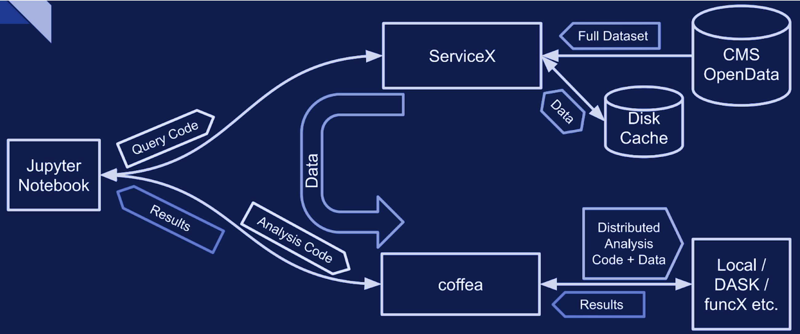

# ServiceX

When dealing with very large datasets it is often better to do initial data filtering, augmentation using `ServiceX <https://iris-hep.org/projects/servicex>`_.
ServiceX transformation produces output as an Awkward Array. The array can then be used in a regular Coffea processing.
Here a scheme explaining the workflow:

   

There are two different, UC AF deployed ServiceX instances. The only difference between them is the type of input data they are capable of processing.
[Uproot](https://uproot-atlas.servicex.af.uchicago.edu/) processes any kind of "flat" ROOT files, while [xAOD](https://xaod.servicex.af.uchicago.edu/) processes only Rucio registered xAOD files.

To use them one has to register and get approved. 
Sign in will lead you to a Globus registration page, where you may choose to use account connected to your institution:

   

Once approved, you will be able to see status of your requests in the dashboard:

   

For your code to be able to authenticate your requests, you need to download a servicex.yaml file, that should be placed in your working directory.
The file is downloaded from your profile page:

   

For an example analysis using ServiceX and Coffea look [here.](https://github.com/iris-hep/analysis-grand-challenge/blob/main/workshops/agctools2021/HZZ_analysis_pipeline/HZZ_analysis_pipeline.ipynb)

## More Examples

Columnar data analysis with DAOD_PHYSLITE [here.](https://github.com/nikoladze/agc-tools-workshop-2021-physlite)

ServiceX analysis on ROOT files, with Coffea, and TRExFitter [here.](https://github.com/kyungeonchoi/ServiceX-at-IRIS-HEP-ACG-workshop-2021)